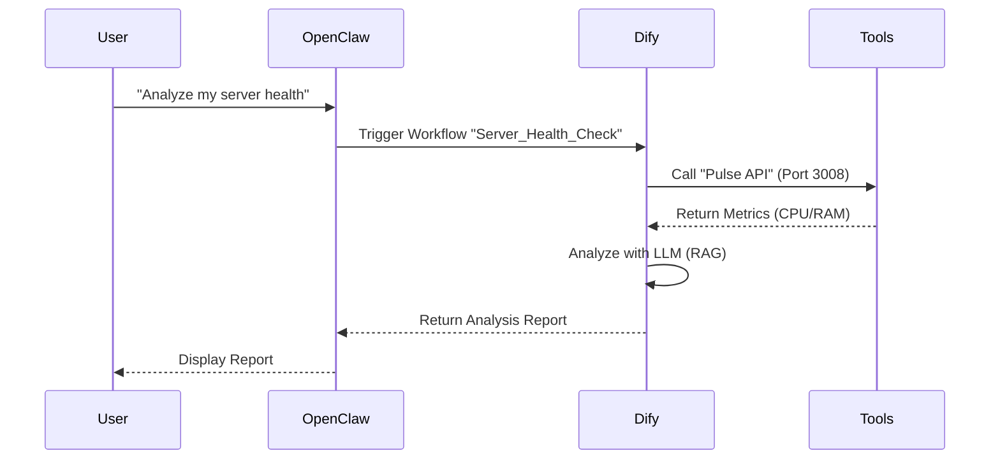

## 1. 背景：从“工具堆叠”到“智能编排”

<!--more-->

在过去的一周里，我们的基础设施经历了快速的垂直扩展。从 `Hoarder` (书签管理) 到 `TrendRadar` (舆情监控)，再到 `Pulse` (系统监控)，我们在 OpenClaw 的生态中部署了大量单点能力的 AI 工具。

然而，单纯的工具堆叠并不等于系统能力的提升。我们需要一个**大脑**来串联这些孤立的节点。

**2026-02-08**，我们部署了 **Dify** (Port 3009)。这不仅是一个新的 Docker 容器，它是我们将 OpenClaw 从“工具箱”升级为“智能操作系统”的关键一步。

### 架构示意图 (System Architecture)

```mermaid
graph TD
    subgraph "Core Orchestration Layer"
        OC[OpenClaw Core] -->|Control| DIFY[Dify (Port 3009)]
        DIFY -->|Execute Workflow| WF{Workflow Engine}
    end

    subgraph "Execution Layer (Docker)"
        WF -->|Monitor| PULSE[Pulse (Port 3008)]
        WF -->|Scrape| TR[TrendRadar (Port 3003)]
        WF -->|Manage| HOARD[Hoarder (Port 3002)]
        WF -->|Interface| WEBUI[Open WebUI (Port 3000/3001)]
    end

    subgraph "Knowledge Base"
        MD[(Memory.md)] -->|Ingest| DIFY
        PDF[(PDF Documents)] -->|Ingest| DIFY
    end

    style OC fill:#f9f,stroke:#333,stroke-width:2px
    style DIFY fill:#bbf,stroke:#333,stroke-width:4px
    style WF fill:#bfb,stroke:#333,stroke-width:2px
```

*(图 1: OpenClaw 核心作为感知层，Dify 作为逻辑编排层，Docker 容器群作为执行层)*

---

## 2. 核心价值：Dify 在架构中的角色

Dify 的引入解决了我们当前架构中的三个痛点：

### A. 可视化工作流 (Visual Workflow Orchestration)
以前，复杂的任务链（例如：“监控 -> 分析 -> 报告”）需要编写大量的胶水代码 (Glue Code)。
现在，利用 Dify 的可视化 Canvas，我们可以通过拖拽节点来定义这些逻辑。
- **Before**: 编写 Python 脚本调用多个 API。
- **After**: 在 Dify 中连接 `HTTP Request` -> `LLM Processing` -> `Tool Output` 节点。

### B. RAG (检索增强生成) 的标准化
我们在 `memory/` 中积累了大量的 Markdown 知识库。Dify 提供了开箱即用的 RAG 管道，支持 PDF、MD、TXT 的自动分段和向量化。这意味着我们可以将 OpenClaw 的长期记忆直接挂载为 Dify 的知识库，供所有 Agent 共享。

### C. 工具生态的拓展
Dify 内置了 50+ 工具（Google Search, Stable Diffusion, WolframAlpha 等）。这极大地补充了 OpenClaw 目前基于 MCP (Model Context Protocol) 的工具库。

---

## 3. 部署细节与工程挑战

### 容器配置
我们在 Port 3009 成功部署了 Dify。配置过程中，我们需要确保它与现有的 `Pulse` (Port 3008) 和 `Open WebUI` (Port 3000/3001) 不发生端口冲突，并共享底层的 GPU 资源（如果可用）。

```yaml
# docker-compose.yml snippet (Conceptual)
services:
  dify-api:
    image: langgenius/dify-api:latest
    ports:
      - "3009:5001"
    environment:
      - DB_HOST=postgres
      - REDIS_HOST=redis
```

### 网络拓扑
目前，OpenClaw (作为 Agent) 运行在 Host 网络或独立的 Docker 网络中。为了让 OpenClaw 能控制 Dify，我们需要打通它们之间的通信链路：
1. **API Access**: OpenClaw 通过 `http://localhost:3009/v1` 调用 Dify 的 API。
2. **Webhook**: Dify 通过 Webhook 回调 OpenClaw 的事件总线。

---

## 4. 下一步计划 (Next Steps)

1. **知识库迁移**: 将 `memory/` 目录下的核心文档（如 `MEMORY.md`, `TOOLS.md`）同步到 Dify 的知识库中。
2. **构建“每日简报” Agent**: 利用 Dify 的工作流，自动抓取 `TrendRadar` (Port 3003) 的数据，生成每日早报。
3. **Skill 整合**: 研究如何将 Dify 定义的 Tool 暴露给 OpenClaw 的 `mcporter`，实现双向调用。

### 未来路线图 (Future Roadmap)



*(图 2: 未来的双向交互——OpenClaw 调用 Dify 工作流，Dify 调用 OpenClaw 本地能力)*

---

**总结**: Dify 的部署标志着我们进入了“Agent 2.0”时代。我们不再只是在命令行里敲命令，而是在构建一个自动运转的智能生态系统。
